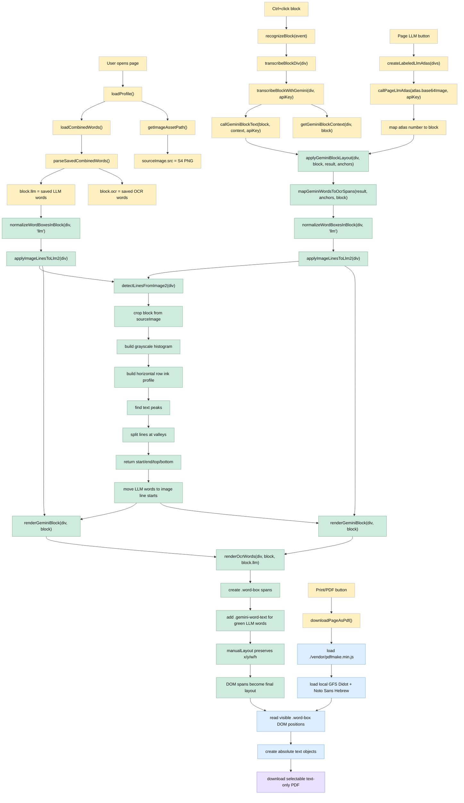

# 17.html + layout.js Function Graph

```mermaid
flowchart TD
  Start["User opens page"] --> LoadProfile["loadProfile()"]
  LoadProfile --> ImagePath["getImageAssetPath()"]
  ImagePath --> LoadImage["sourceImage.src = S4 PNG"]
  LoadProfile --> LoadWords["loadCombinedWords()"]
  LoadWords --> ParseWords["parseSavedCombinedWords()"]
  ParseWords --> SavedOCR["block.ocr = saved OCR words"]
  ParseWords --> SavedLLM["block.llm = saved LLM words"]
  SavedLLM --> NormalizeSaved["normalizeWordBoxesInBlock(div, 'llm')"]
  NormalizeSaved --> ImgLineSaved["applyImageLinesToLlm2(div)"]
  ImgLineSaved --> RenderSaved["renderGeminiBlock(div, block)"]

  CtrlClick["Ctrl+click block"] --> RecognizeBlock["recognizeBlock(event)"]
  RecognizeBlock --> TranscribeDiv["transcribeBlockDiv(div)"]
  TranscribeDiv --> TranscribeGemini["transcribeBlockWithGemini(div, apiKey)"]
  TranscribeGemini --> GeminiContext["getGeminiBlockContext(div, block)"]
  TranscribeGemini --> GeminiCall["callGeminiBlockText(block, context, apiKey)"]
  GeminiCall --> ApplyLayout["applyGeminiBlockLayout(div, block, result, anchors)"]

  PageLLM["Page LLM button"] --> Atlas["createLabeledLlmAtlas(divs)"]
  Atlas --> PageGemini["callPageLlmAtlas(atlas.base64Image, apiKey)"]
  PageGemini --> MapAtlas["map atlas number to block"]
  MapAtlas --> ApplyLayout

  ApplyLayout --> MapWords["mapGeminiWordsToOcrSpans(result, anchors, block)"]
  MapWords --> NormalizeNew["normalizeWordBoxesInBlock(div, 'llm')"]
  NormalizeNew --> ImgLineNew["applyImageLinesToLlm2(div)"]
  ImgLineNew --> RenderNew["renderGeminiBlock(div, block)"]

  ImgLineNew --> Detect2["detectLinesFromImage2(div)"]
  ImgLineSaved --> Detect2
  Detect2 --> CanvasCrop["crop block from sourceImage"]
  CanvasCrop --> Histogram["build grayscale histogram"]
  Histogram --> InkProfile["build horizontal row ink profile"]
  InkProfile --> Peaks["find text peaks"]
  Peaks --> Valleys["split lines at valleys"]
  Valleys --> LineBoxes["return start/end/top/bottom"]
  LineBoxes --> MoveLLM["move LLM words to image line starts"]
  MoveLLM --> RenderNew
  MoveLLM --> RenderSaved

  RenderNew --> RenderOcrWords["renderOcrWords(div, block, block.llm)"]
  RenderSaved --> RenderOcrWords
  RenderOcrWords --> WordBoxes["create .word-box spans"]
  WordBoxes --> GeminiText["add .gemini-word-text for green LLM words"]
  GeminiText --> ManualLayout["manualLayout preserves x/y/w/h"]
  ManualLayout --> DOMReady["DOM spans become final layout"]

  PdfButton["Print/PDF button"] --> PdfExport["downloadPageAsPdf()"]
  PdfExport --> PdfMake["load ./vendor/pdfmake.min.js"]
  PdfMake --> PdfFonts["load local GFS Didot + Noto Sans Hebrew"]
  PdfFonts --> ReadSpans["read visible .word-box DOM positions"]
  DOMReady --> ReadSpans
  ReadSpans --> PdfText["create absolute text objects"]
  PdfText --> PdfDownload["download selectable text-only PDF"]

  classDef html fill:#fff0c2,stroke:#b8bcc4,color:#111;
  classDef layout fill:#cfebdd,stroke:#7aa890,color:#111;
  classDef external fill:#dceeff,stroke:#78a8d8,color:#111;
  classDef output fill:#e9e2ff,stroke:#9a86d8,color:#111;

  class Start,LoadProfile,ImagePath,LoadImage,LoadWords,ParseWords,SavedOCR,SavedLLM,CtrlClick,RecognizeBlock,TranscribeDiv,TranscribeGemini,GeminiContext,GeminiCall,PageLLM,Atlas,PageGemini,MapAtlas,PdfButton,PdfExport html;
  class ApplyLayout,MapWords,NormalizeSaved,NormalizeNew,ImgLineSaved,ImgLineNew,Detect2,CanvasCrop,Histogram,InkProfile,Peaks,Valleys,LineBoxes,MoveLLM,RenderSaved,RenderNew,RenderOcrWords,WordBoxes,GeminiText,ManualLayout,DOMReady layout;
  class PdfMake,PdfFonts,ReadSpans,PdfText external;
  class PdfDownload output;
```

